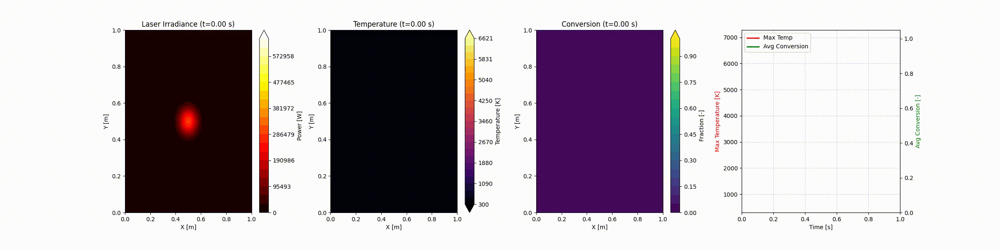

# FEM Heat Transfer with Reactive Medium

This project models chemical conversion in a 2D domain with heat sources from a pulsed laser and the resulting exotherms of heated reactants.  

---

The beam is modeled as Gaussian (spatially and temporally) and the reaction is modeled with first order kinetics, advanced explicitly.  Heat diffusion is solved with a fully implicit (backward-Euler) time discretization.  The model tracks both the temperature field and a local conversion fraction and outputs an animation of the subsequent plots.

## to-do

implement Asma's estimates:
>The dominant reaction observed is H₂ release from decaborane. For a single decaborane molecule, the reaction barrier for dehydrogenation is approximately **120 kcal/mol**, which is consistent with the DFT results shown in Slide 1. This barrier is relatively high.
To address this, we examined H₂ release during decaborane dimerization. ReaxFF predicts a significantly lower endothermicity and a much lower reaction barrier for H₂ release in this case. The H₂ release energy obtained from ReaxFF is approximately **40 kcal/mol**, as shown in Slide 2.
Additionally, we removed several H₂ units from decaborane (B₁₀H₁₄) to form B₁₀H₈, generated a system of ten such units, and performed molecular dynamics simulations with a temperature ramp from 300 K to 1500 K. As shown in Slide 3, we observe a substantial exothermic energy release associated with the formation of a large boron cluster (H₈₀B₁₀₀) at lower temperatures (300–400 K). The potential energy decrease is approximately **−800 kcal/mol**.
Finally, DFT/NEB calculations for decaborane dimerization from the USC group indicate an activation energy of approximately **106 kcal/mol**, with a reaction energy of about **1 kcal/mol**, as shown in Slides 4 and 5.

Troubleshooting
- [ ] increase volumetric heat capacity to minimize instability from heat flow sensitivity?
- get more realistic heat diffusion rate with more realistic time and distance units
  - [ ] time -> 1/20000 Hz -> 0.00005 s  
- throw warnings when:
  - [ ] final_t/dt is a non-integer
  - [ ] dx/dy is non-uniform
  - [ ] dx fails condition to resolve FWHM of pulse (>~10 points over 2.35$\sigma$)
  - [ ] dt fails condition of Fourier stability Fo = $\alpha (dt / dx^2)$ -> $dt = Fo(dx^2/\alpha)$ (though should this scheme be unconditionally stable?)
    - check with dx and dx/2 to see if peak temp over time is different

Features
 - QoL
   - [x] print time taken for simulations along with the number of grid points and time steps
   - [x] CLI status bar
 - [ ] find dt and dx threshold that extinguishes quantization artifacts
 - implement relevant realism
   - [x] check Adri videos to find realistic parameters (email Jupjeet)
     - [ ] follow up with Adri and Asma
   - [ ] multiple pulses, moving pulses, and scan lines
 - [ ] parameterize physical variables 
  - [ ] for resolved pulse heat localization
  - [ ] with realistic variable ranges
- [ ] convert output to realistic units (s -> ms? m -> cm?)
 - [ ] overlay isotherm/isoconversion contours in the figures
- [ ] account for more advanced considerations:
- [ ] additional absorption proportional to existing conversion

## Physics Model

### Heat Transfer Equation
The temperature evolution $T(x,y,t)$ is governed by the heat diffusion equation with source terms:

$$
\rho C_p \frac{\partial T}{\partial t} = k \nabla^2 T + S_{laser}(x,y,t) + Q_{reaction}(x,y,t)
$$

Where:
- $\rho$: Density $[kg/m^3]$
- $C_p$: Specific Heat Capacity $[J/(kg \cdot K)]$
- $k$: Thermal Conductivity $[W/(m \cdot K)]$
- $S_{laser}$: External laser heat source $[W/m^3]$
- $Q_{reaction}$: Heat generation/consumption from chemical reaction $[W/m^3]$

### Laser Source
Modeled as a Gaussian pulse in both space and time:

$$
S_{laser}(x,t) = P_{peak} \cdot \exp\left(-\frac{|\mathbf{x} - \mathbf{x}_c|^2}{2\sigma^2}\right) \cdot \exp\left(-\frac{(t - t_0)^2}{2\tau^2}\right)
$$

### Chemistry Model
The medium undergoes a simple unimolecular conversion $A \to B$. The degree of conversion $\alpha$ (0 to 1) follows first-order Arrhenius kinetics:

$$
\frac{d\alpha}{dt} = (1 - \alpha) A \exp\left(-\frac{E_a}{R T}\right)
$$

The reaction heat source is proportional to the reaction rate:
$$
Q_{reaction} = \rho \Delta H \frac{d\alpha}{dt}
$$
- $\Delta H > 0$: Exothermic (releases heat)
- $\Delta H < 0$: Endothermic (absorbs heat)

## Numerical Algorithms

### Finite Element Method (FEM)
The spatial domain is discretized using **Linear Triangular Elements**.
- **Weak Formulation**: Multiplying by a test function $v$ and integrating over the domain $\Omega$:
  $$
  \int_\Omega \rho C_p \dot{T} v \, d\Omega + \int_\Omega k \nabla T \cdot \nabla v \, d\Omega = \int_\Omega (S + Q) v \, d\Omega
  $$
- This leads to the matrix system:
  $$
  M \mathbf{\dot{T}} + K \mathbf{T} = \mathbf{F}
  $$
  Where $M$ is the Mass Matrix and $K$ is the Stiffness Matrix.

### Time Integration
The system is evolved in time using a split scheme:

1.  **Reaction Step (Explicit)**:
    - $\alpha$ is updated using the current Temperature:
    $$
    \alpha_{n+1} = \alpha_n + \Delta t \cdot \text{Rate}(T_n, \alpha_n)
    $$
    - The reaction heat $Q$ is computed based on this rate.

2.  **Heat Diffusion Step (Implicit Backward Euler)**:
    - unconditional stability is achieved by evaluating gradients at $t_{n+1}$:
    $$
    (M + \Delta t K) \mathbf{T}_{n+1} = M \mathbf{T}_n + \Delta t \mathbf{F}_{source}
    $$
    - This requires solving a sparse linear system at each time step.

### Boundaries
 - migrating from zero-flux (Neumann) boundaries to either fixed/isothermal (Dirichlet) or elastic (Robin) boundaries

## Implementation Details
- **Mesh**: Structured generated mesh of triangles.
- **Assembly**: Custom python loop for element matrices (Mass, Stiffness).
- **Solver**: `scipy.sparse.linalg.spsolve` for efficient linear algebra.
- **Visualization**: `matplotlib.animation` creates a video showing:
    1.  Laser intensity profile.
    2.  Temperature field.
    3.  Conversion field.
    4.  Time-evolution of peak values.
