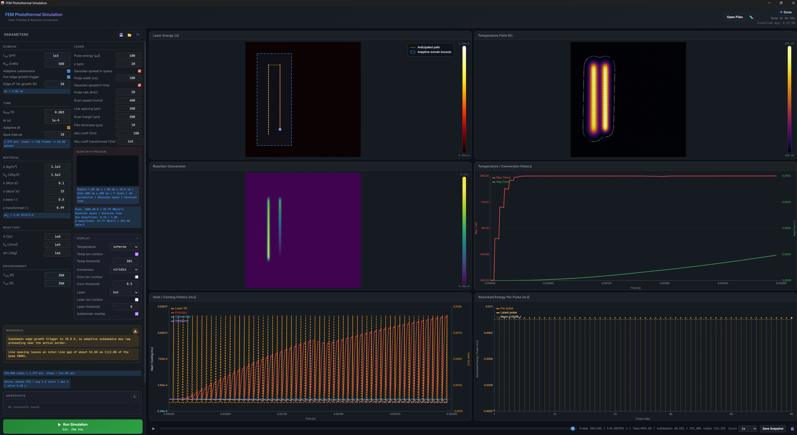

# FEM Heat Transfer with Reactive Medium

This project models chemical conversion in a 2D domain with heat sources from a pulsed laser and the resulting exotherms of heated reactants.  

---

The beam is modeled as Gaussian (spatially and temporally) and the reaction is modeled with first order kinetics, advanced explicitly.  Heat diffusion is solved with a fully implicit (backward-Euler) time discretization.  The model tracks both the temperature field and a local conversion fraction and outputs an animation of the subsequent plots.

## to-do

### implement Asma's estimates:
>The dominant reaction observed is H₂ release from decaborane. For a single decaborane molecule, the reaction barrier for dehydrogenation is approximately **120 kcal/mol**, which is consistent with the DFT results shown in Slide 1. This barrier is relatively high.
To address this, we examined H₂ release during decaborane dimerization. ReaxFF predicts a significantly lower endothermicity and a much lower reaction barrier for H₂ release in this case. The H₂ release energy obtained from ReaxFF is approximately **40 kcal/mol**, as shown in Slide 2.
Additionally, we removed several H₂ units from decaborane (B₁₀H₁₄) to form B₁₀H₈, generated a system of ten such units, and performed molecular dynamics simulations with a temperature ramp from 300 K to 1500 K. As shown in Slide 3, we observe a substantial exothermic energy release associated with the formation of a large boron cluster (H₈₀B₁₀₀) at lower temperatures (300–400 K). The potential energy decrease is approximately **−800 kcal/mol**.
Finally, DFT/NEB calculations for decaborane dimerization from the USC group indicate an activation energy of approximately **106 kcal/mol**, with a reaction energy of about **1 kcal/mol**, as shown in Slides 4 and 5.

---

## Parameter considerations

### Asma thermodynamic estimates
*abridged; see email for slideshow and details*
Ea = 167 kJ/mol 
 - (40 kcal/mol)
 - for low-barrier dimerization-initiation of B10H14

dH = 3340 kJ/mol
 - (800 kcal/mol)
 - 3340 kJ/mol * 5.2 mol/kg = 1.7e7 J/kg
 - B10H8 forming large B clusters

---

*some insights from (2018) Li et al:* [here](<literature/(2018) Li et al - Synthesis and ceramic conversion of a new organodecaborane preceramic polymer with high ceramic yield.pdf>)

---
 
### process simplification
full thermo consideration seemingly would many processes:
1) dehydrogenation of B10H14 to B10H8
2) backbone scission
3) graphitization
4) dimerization of B10H8 to B20H16
5) cluster growth to large (100+) B clusters (**primary exotherm**)
6) B-C formation
7) pyrolysis (**mass loss -> heat loss**)
8) densification?

insofar as the backbone scission/pyrolysis can be simplified to **polyethylene**, [(2023) Mastalski et al](<literature/(2023) Mastalski et al - Intrinsic millisecond kinetics of polyethylene pyrolysis via pulse-heated analysis of solid reactions.pdf>) reports PE pyrolysis activation energy (Ea) and pre-exponential factor (A) as:

$Ea = 180 +/- 2.5 \space kJ \cdot mol^{-1}$  

 - will deviate depending on whether the transition state is stabilized or destabilized by the boron pendants/clusters

$A = 10^{11} \space s^{-1}$

- unimolecular bond-scission seems to appear around 2 orders of magnitude of here
- will go down if observed rate is transport-limited

(just starting to build rough estimates, I don't necessarily have a good reason to believe the kinetics are rate-limited here)

---

For the H2 evolution in the dehydrogenation step, (2015) Barm et al. reported [here](<literature/(2015) Barm et al - A new homogeneous catalyst fo the dehydrogenation of dimethylamine borane starting with ruthenium(III) acetylacetonate.pdf>) on an amine-borane dehydrogenation catalyst with Ea = 85 kJ/mol.  It's not clear if there is any catalytic effect from the boron clusters, but this is perhaps useful as a lower bound for dehydrogenation.

- solid mass transfer constraint probably prevents H2 diffusion and depresses effective pre-factor 
---

Other than laser absorption, reaction enthalpy ($\Delta H$) stands to play a substantial role in the transfer of thermal energy, but so does phase change and mass loss (pyrolysis). 

B10H14 heat capacity

---

### misc. scratch calculations
density of the poly-decaborane monomer
B10H14 MW = 122 g/mol
C5H10 = 70 g/mol
total density = 192 g/mol
1000 g/kg / 192 g/mol = **5.2 mol/kg**

### get to the point
which effect(s) most contribute to the 'all-or-nothing' transformation borders?
- rapid cooling
- beam non-uniformity
- dynamic material
  - absorptivity
    - *(pick a similar material for absorption)*
  - emissivity
  - density (shielding?)
- enthalpic heating
  - establish better mass enthalpy
- neighboring beam overlap

### tauri to-do 

- why does the first pulse absorb more than the next pulse?  grid spacing thing?  change with adaptive dt or Nxy?

- when does the subdomain increase?  seems like a 0.01 increase in temp is hardly halfway to the edge...maybe increase to a 1

- [x] pulse energy reports appear ~3 orders of magnitude too high (~.2 J instead of .2 mJ)

- [x] attempt a fully compiled run after basic updates 
  - seemed substantially faster, though the desired parameters could not simulate in <30 min (a progress bar has been added to ascertain necessary improvement more helpfully)

- [ ] re-read previous thermal transfer for other methods (RK4 + CFL number)
  - [ ] stability check method: fourier number more relevant than CFL? we have "much more of a diffusion-reaction problem than an advection problem"
  - [ ] 

- [ ] noting/planning on advanced considerations
  - [ ] substrate (conduction, absorption)

- [x] DA thumbnail

- [ ] make the storage and/or playing of the files more efficient (can't it just be appending images?  or using ffmpeg to get an mp4 as the final step?)

- [ ] checkbox for auto-export the pulse-active frames

- [x] when none of the warnings are active, add a green checkmark which reveals what checks have been conducted and passed on mouse hover.  When some warnings are active, replace the checkmark with a yellow warning symbol which similarly reveals which have passed and which have failed

- [x] also, to the display color maps, add an option for each to add an iso-contour and at what threshold

- [x] also, when any individual graph is clicked, have it enlarge to take up the whole graph section of the window.  on a second click, put it back where it was

- [x] second absorbance coefficient for polymer vs char product

- [x] show current project size in the corner

- [x] progress bar, time estimate on 'run' button

- [x] why cant't 1e-6 dt return increased temperatures when 1e-5 and 1e-7 both do?

- [x] mismatch warning (e.g., save intervals don't appears on the pulse flashes)

- [x] make units more sensible and maintain 'e' representation

- [x] have two parameters columns be the case independent of the window size.  Then move the laser section (including the scan path preview) to the right column and the current right column sections (time, reaction, and environment) to the left column

- [x] don't erase the current plots until 'run simulation' (or maybe add a 'clear'?) is selected

- [x] make sure the operations calculation in the parameters section is being updated when either nodes or steps are updated

- [x] show a scan path preview on application startup instead of waiting for the first parameter edit

- [x] take steps to ensure the values on the figures' color ramp bars don't fall off the edge of the card.  perhaps move the graph card contents to the left and then shorten the bar a bit so the top and bottom values can sit above and below the bar, center aligned.

- [x] create a 'display' menu where the user can choose which color maps to use

- [x] for numbers in the parameter fields which exceed 1000, default to representing them with 'e' (e.g., 5500000 = 5.5e6)

### questions

- what tests are established for `cargo test --quiet` to read from?

- proposals
  - implicit schemes
  - stiff timesteps
  - 2.5D
  - how much do k, cp, and rho change at these temperatures and timescales?
  - hyperbolic vs parabolic instability
    - von neumann analysis --> amplification factor
  - "many heat solvers move to implicit methods because F0 restriction is brutal" e.g., backward euler, crank-nicolson, ADI, multigrid implicit solves
  - kinetics model selector on the backend
  - implication of triangulation
  - stiffness [wiki](https://en.wikipedia.org/wiki/Stiff_equation)

- mesh refinement and timestep refinement studies, reporting change in peak temperature and final conversion
- adaptive timestepping (reduce dt near pulse peaks, increase dt during cooling periods)

The actual adaptive timestep is computed in the Rust backend, not in the UI. The controlling function is adaptive_step_size(), and it treats the entered dt as a maximum step size.

Per step, it does this:

It first caps the step to the remaining time in the run: dt_cap = min(dt_max, t_final - time) in lib.rs.
If adaptive stepping is off, it returns that cap immediately in lib.rs.
If Gaussian temporal spreading is on, and the current time is within about ±3 sigma of the pulse center, it limits dt to about pulse_width / 6 in lib.rs and lib.rs.
If Gaussian temporal spreading is off, it instead limits dt to no larger than the pulse period so multiple instant pulses do not collapse into one step in lib.rs.
It computes the current maximum reaction-rate magnitude max_alpha_rate and limits dt <= 0.02 / max_alpha_rate in lib.rs.
It estimates a max temperature-rate from laser source, radiative cooling, and reaction heat release, then limits dt <= 2.0 / max_temp_rate in lib.rs.
It applies a lower bound so dt cannot collapse too far: roughly dt_max * 1e-4, tightened further to pulse_width / 80 for Gaussian pulses or to the pulse period for single-step pulses in lib.rs.
It also prevents step size from growing too fast by enforcing dt <= 1.6 * previous_dt in lib.rs.
That chosen step_dt is recalculated every iteration of the time loop in lib.rs and then used in lib.rs. The next step uses the previous accepted step_dt as part of the growth limiter in lib.rs.

One important detail: this is a heuristic physics-based controller, not an error-estimator-based adaptive integrator. It reacts to pulse timing, reaction speed, and heating/cooling rate. It does not compare two solutions of different order the way RK adaptive stepping would.

Also, with your new pulse toggle:

Gaussian time on: the pulse source is spread over time by a Gaussian envelope in physics.rs.
Gaussian time off: pulse energy is deposited in a single timestep by counting pulses that land in that step window in physics.rs and physics.rs.
The UI only estimates how many steps that might produce for the info panel/button text in main.js; the backend logic above is the real authority.

heat/cooling history graph seems highly stretched horizontally

---

Troubleshooting
- [ ] increase volumetric heat capacity to minimize instability from heat flow sensitivity?
- get more realistic heat diffusion rate with more realistic time and distance units
  - [ ] time -> 1/20000 Hz -> 0.00005 s  
- throw warnings when:
  - [ ] final_t/dt is a non-integer
  - [ ] dx/dy is non-uniform
  - [ ] dx fails condition to resolve FWHM of pulse (>~10 points over 2.35$\sigma$)
  - [ ] dt fails condition of Fourier stability Fo = $\alpha (dt / dx^2)$ -> $dt = Fo(dx^2/\alpha)$ (though should this scheme be unconditionally stable?)
    - check with dx and dx/2 to see if peak temp over time is different

Features
 - QoL
   - [x] print time taken for simulations along with the number of grid points and time steps
   - [x] CLI status bar
 - [ ] find dt and dx threshold that extinguishes quantization artifacts
 - implement relevant realism
   - [x] check Adri videos to find realistic parameters (email Jupjeet)
     - [ ] follow up with Adri and Asma
   - [ ] multiple pulses, moving pulses, and scan lines
 - [ ] parameterize physical variables 
  - [ ] for resolved pulse heat localization
  - [ ] with realistic variable ranges
- [ ] convert output to realistic units (s -> ms? m -> cm?)
 - [ ] overlay isotherm/isoconversion contours in the figures
- [ ] account for more advanced considerations:
- [ ] additional absorption proportional to existing conversion

## Physics Model

### Heat Transfer Equation
The temperature evolution $T(x,y,t)$ is governed by the heat diffusion equation with source terms:

$$
\rho C_p \frac{\partial T}{\partial t} = k \nabla^2 T + S_{laser}(x,y,t) + Q_{reaction}(x,y,t)
$$

Where:
- $\rho$: Density $[kg/m^3]$
- $C_p$: Specific Heat Capacity $[J/(kg \cdot K)]$
- $k$: Thermal Conductivity $[W/(m \cdot K)]$
- $S_{laser}$: External laser heat source $[W/m^3]$
- $Q_{reaction}$: Heat generation/consumption from chemical reaction $[W/m^3]$

### Laser Source
Modeled as a Gaussian pulse in both space and time:

$$
S_{laser}(x,t) = P_{peak} \cdot \exp\left(-\frac{|\mathbf{x} - \mathbf{x}_c|^2}{2\sigma^2}\right) \cdot \exp\left(-\frac{(t - t_0)^2}{2\tau^2}\right)
$$

### Chemistry Model
The medium undergoes a simple unimolecular conversion $A \to B$. The degree of conversion $\alpha$ (0 to 1) follows first-order Arrhenius kinetics:

$$
\frac{d\alpha}{dt} = (1 - \alpha) A \exp\left(-\frac{E_a}{R T}\right)
$$

The reaction heat source is proportional to the reaction rate:
$$
Q_{reaction} = \rho \Delta H \frac{d\alpha}{dt}
$$
- $\Delta H > 0$: Exothermic (releases heat)
- $\Delta H < 0$: Endothermic (absorbs heat)

## Numerical Algorithms

### Finite Element Method (FEM)
The spatial domain is discretized using **Linear Triangular Elements**.
- **Weak Formulation**: Multiplying by a test function $v$ and integrating over the domain $\Omega$:
  $$
  \int_\Omega \rho C_p \dot{T} v \, d\Omega + \int_\Omega k \nabla T \cdot \nabla v \, d\Omega = \int_\Omega (S + Q) v \, d\Omega
  $$
- This leads to the matrix system:
  $$
  M \mathbf{\dot{T}} + K \mathbf{T} = \mathbf{F}
  $$
  Where $M$ is the Mass Matrix and $K$ is the Stiffness Matrix.

### Time Integration
The system is evolved in time using a split scheme:

1.  **Reaction Step (Explicit)**:
    - $\alpha$ is updated using the current Temperature:
    $$
    \alpha_{n+1} = \alpha_n + \Delta t \cdot \text{Rate}(T_n, \alpha_n)
    $$
    - The reaction heat $Q$ is computed based on this rate.

2.  **Heat Diffusion Step (Implicit Backward Euler)**:
    - unconditional stability is achieved by evaluating gradients at $t_{n+1}$:
    $$
    (M + \Delta t K) \mathbf{T}_{n+1} = M \mathbf{T}_n + \Delta t \mathbf{F}_{source}
    $$
    - This requires solving a sparse linear system at each time step.

### Boundaries
 - migrating from zero-flux (Neumann) boundaries to either fixed/isothermal (Dirichlet) or elastic (Robin) boundaries

## Implementation Details
- **Mesh**: Structured generated mesh of triangles.
- **Assembly**: Custom python loop for element matrices (Mass, Stiffness).
- **Solver**: `scipy.sparse.linalg.spsolve` for efficient linear algebra.
- **Visualization**: `matplotlib.animation` creates a video showing:
    1.  Laser intensity profile.
    2.  Temperature field.
    3.  Conversion field.
    4.  Time-evolution of peak values.
